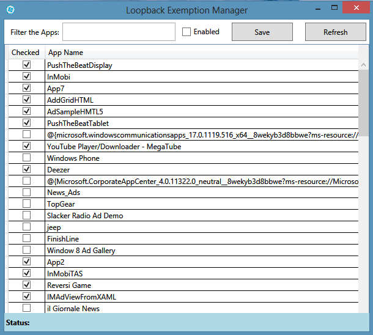

# Project Description

GUI to enable Loopback Exemptions for Universal Windows Apps and Windows 8 Modern UI Apps 

By default, Windows Modern UI and Universal Apps are forbidden to send network traffic to the local Computer. In order to debug Apps with a tool, we need to enable Loopback capabilities for those Apps.
This tool enables the management of the Apps that can connect to the local Computer.

# More information about this topic
- [Revisiting Fiddler and Windows 8 Metro-style applications](http://blogs.msdn.com/b/fiddler/archive/2011/12/10/fiddler-windows-8-apps-enable-loopback-network-isolation-exemption.aspx])
- [Fiddler and Windows 8 Metro-style applications](http://blogs.msdn.com/b/fiddler/archive/2011/09/14/fiddler-and-windows-8-metro-style-applications-https-and-private-network-capabilities.aspx)
- [How to enable loopback and troubleshoot network isolation (Windows Store apps)](http://msdn.microsoft.com/en-us/library/windows/apps/Hh780593.aspx)

# Network Isolation APIs
Check the source code of this project on a sample usage of the Network Isolation APIs : 
NetworkIsolationEnumAppContainers 
NetworkIsolationFreeAppContainers 
NetworkIsolationGetAppContainerConfig 
NetworkIsolationSetAppContainerConfig

This tool does basically the same thing as Fiddler EnableLoopback Utility available [here](https://telerik-fiddler.s3.amazonaws.com/fiddler/addons/enableloopbackutility.exe)

Thanks to [Eric Lawrence](http://stackoverflow.com/users/126229/ericlaw) for helping with the PInvokes.

Project migrated from https://loopback.codeplex.com/ (May 2017).
